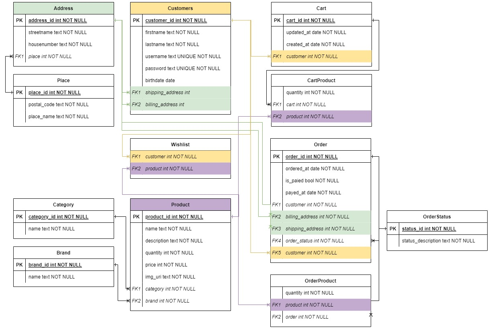
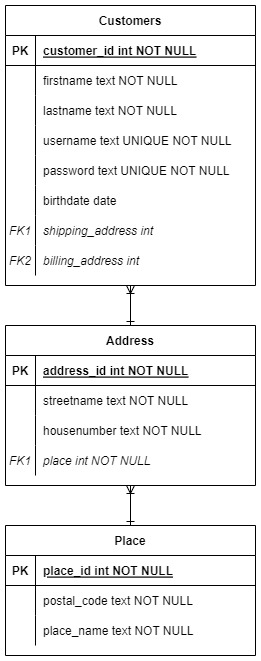
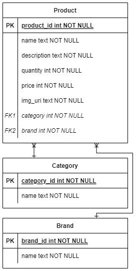
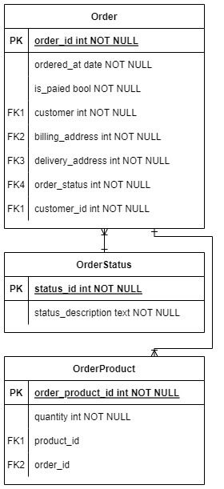
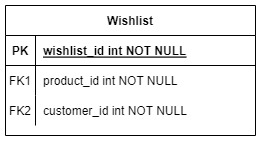

# Dokumentation: JEE Onlineshop
HS 2022, Java Enterprise Edition, Fabian Diemand  
Dozent: Daniel Senften  
Repository: https://git.ffhs.ch/fabian.diemand/jee-onlineshop/  

---

## Inhalt
- [1 Einleitung](#el_einleitung)
  - [1.1 Abgrenzung](#el_abgrenzung)
  - [1.2 Glossar](#el_glossar)
- [2 Verwendete Technologien](#vt_verwendetetechnologien)
  - [2.1 IntelliJ IDEA](#vt_intellij)
  - [2.2 Java EE 8](#vt_javaee8)
  - [2.3 Glassfish Server](#vt_glassfish)
  - [2.4 PostgreSQL](#vt_postgresql)
  - [2.5 GitLab](#vt_gitlab)
- [3 Funktionale Anforderungen](#fa_funktionaleanforderungen)
  - [3.1 Shop - Product Overview](#fa_productoverview)
  - [3.2 Shop - Product Cart](#fa_productcart)
  - [3.3 Shop - Buy Product](#fa_buyproduct)
  - [3.4 Customer Management - Registration](#fa_registration)
  - [3.5 Customer Management - Sign In](#fa_signin)
  - [3.6 Customer Profile - Customer Info](#fa_customerinfo)
  - [3.7 Customer Profile - Wishlist](#fa_wishlist)
  - [3.8 Customer Profile - Order History](#fa_orderhistory)
- [4 Datenmodell](#dm_datenmodell)
  - [4.1 Customer](#dm_customer)
  - [4.2 Product](#dm_product)
  - [4.3 Cart](#dm_cart)
  - [4.4 Order](#dm_order)
  - [4.5 Wishlist](#dm_wishlist)
- [Quellen](#quellen)
- [Statusberichte](#statusberichte)

---

## 1 Einleitung
Das folgende Dokument enthält die Dokumentation der Semesterarbeit im Modul JEE (Java Enterprise Edition),
des Herbstsemesters 2022/23 an der Fernfachhochschule Schweiz.
Im Kern geht es dabei um die Erweiterung des Onlineshops aus der Literatur zum Unterricht (Java EE 8, Alexander Salvanos).

### 1.1 Abgrenzung
Im Rahmen der Semesterarbeit wird sich vordergründig auf die Implementation eines Kundenprofils zum Onlineshop konzentriert.
Dabei wird das Hauptaugenmerk auf die serverseitigen Funktionen gelegt. Die Klienten-Seite wird nur in einem für eine Demo nötigen Umfang
umgesetzt.

### 1.2 Glossar
| Begriff    | Erklärung                                                                                                                |
|------------|--------------------------------------------------------------------------------------------------------------------------|
| Besuchende | Personen, die den Onlineshop besuchen, dabei jedoch noch nicht unbedingt etwas kaufen wollen und nicht registriert sind. |
| Gastkäufer | Personen, die einen Kauf beabsichtigen ohne sich aber als feste Kundschaft registrieren zu wollen.                       |
| Kundschaft | Personen, die einen Kauf beabsichtigen, sich dabei registrieren oder bereits registriert sind.                           |

---

## 2 Verwendete Technologien
Der Onlineshop soll eine Web-Applikation sein. Zu deren Umsetzung werden folgende Technologien verwendet.

### 2.1 IntelliJ IDEA
Als Entwicklungsumgebung für die Java EE Web-Applikation dient IntelliJ IDEA von Jetbrains.

### 2.2 Java EE 8
Gemäss der verwendeten Literatur soll für die Web-Applikation Java als Programmiersprache, in der Spezifikation EE 8,
verwendet werden. Hinsichtlich der Version behält sich der Autor Änderungen vor. Diese würden entsprechend dokumentiert werden.

### 2.3 Oracle Glassfish Server 6.2.5
Als Applikationsserver wird der Glassfish Open-Source-Anwendungsserver von Oracle in der Version 6.2.5 verwendet.
Glassfish ist als Anwendungsserver für Java EE konzipiert und daher speziell für dieses Vorhaben geeignet.

### 2.4 PostgreSQL 15
Das objektrelationale Datenbankmanagementsystem (ORDBMS) PostgreSQL wird genutzt, um die Datenpersistenz zu gewährleisten.

### 2.5 GitLab
Für die Source-Code-Verwaltung und die Versionierung wird GitLab verwendet. Innerhalb von Gitlab werden insbesondere Issues verwendet,
um User Stories und Tasks zu erfassen. Zu Planungszwecken wird ausserdem ein Board mit den Phasen "Backlog", "Sprint Backlog", "Development",
"Verification" und "Done" erstellt.

Die Branch-Strategie folgt grundsätzlich den Empfehlungen des Git-flow-Workflow (vgl. [GitFlow]).

---

## 3 Funktionale Anforderungen
Die funktionalen Anforderungen werden in der Form von User Stories erfasst. Jede User Story enthält eine Kurzbeschreibung, 
eine längere technischere Beschreibung und eine Definition-of-Done (DoD) mit Akzeptanzkriterien. Ausserdem enthalten einige
User Stories eine Definition-of-Ready, wenn entsprechende Abhängigkeiten bestehen.

Für die Umsetzung werden alle User Stories in Tasks aufgebrochen, welche wie die User Stories selbst als Issues im entsprechenden
GitLab Repository erfasst sind. Im Rahmen der Dokumentation wird nur auf die User Stories eingegangen. Der Übersicht halber werden
diese in Use-Case-Form erfasst.

### 3.1 Shop - Product Overview
<table>
  <tr>
    <th>Name</th>
    <td>Shop - Product Overview</td>
  </tr>
  <tr>
    <th>Ziel</th>
    <td>
      Akteure erhalten einen Überblick über die zur Verfügung stehenden Produkte mit den Optionen, sich diese
      anzuschauen, zu kaufen oder auf eine Favoritenliste zu legen.
    </td>
  </tr>
  <tr>
    <th>Akteure</th>
    <td>Besuchende, Gäste, Kundschaft</td>
  </tr>
  <tr>
    <th>Vorbedingung</th>
    <td>-</td>
  </tr>
  <tr>
    <th>Auslösendes Ereignis</th>
    <td>Akteure besuchen den Onlineshop.</td>
  </tr>
  <tr>
    <th>Nachbedingung Normalfall</th>
    <td>Akteure sehen alle zur Verfügung stehenden Produkte.</td>
  </tr>
  <tr>
    <th>Nachbedingung Sonderfall</th>
    <td>Akteure werden mit einer Nachricht, an Stelle der Übersicht, darüber informiert, dass aktuell keine Produkte zum Verkauf stehen.</td>
  </tr>
  <tr>
    <th>Normalfall</th>
    <td>
      1. Akteure besuchen den Onlineshop 
      2. Akteure werden direkt auf die Produktübersicht geroutet 
    </td>
  </tr>
  <tr>
    <th>Sonderfall</th>
    <td>2a. Es stehen aktuell keine Produkte zum Verkauf</td>
  </tr>
</table>

### 3.2 Shop - Product Cart
<table>
  <tr>
    <th>Name</th>
    <td>Shop - Product Cart</td>
  </tr>
  <tr>
    <th>Ziel</th>
    <td>Akteure können Produkte in einen Warenkorb legen, die sie später kaufen möchten.</td>
  </tr>
  <tr>
    <th>Akteure</th>
    <td>Gäste, Kundschaft</td>
  </tr>
  <tr>
    <th>Vorbedingung</th>
    <td>Im Shop stehen Produkte zum Kauf zur Verfügung.</td>
  </tr>
  <tr>
    <th>Auslösendes Ereignis</th>
    <td>Akteur will Produkt kaufen.</td>
  </tr>
  <tr>
    <th>Nachbedingung Normalfall</th>
    <td>Produkte die gekauft werden sollen liegen im Warenkorb.</td>
  </tr>
  <tr>
    <th>Nachbedingung Sonderfall</th>
    <td>
      1a. Produkte, die im Warenkorb liegen, werden ohne den entsprechenden Knopf für die Ablage dargestellt.
      2a. Kaufknopf steht erst ab mindestens einem Produkt im Warenkorb zur Verfügung.
    </td>
  </tr>
  <tr>
    <th>Normalfall</th>
    <td>
      1. Akteur klickt auf den Knopf, der ein Produkt in den Warenkorb legt 
      2. Akteur klickt im Warenkorb auf den Knopf, um die abgelegten Produkte zu kaufen 
      3. Akteur wird auf die Kaufmaske weitergeleitet 
    </td>
  </tr>
  <tr>
    <th>Sonderfall</th>
    <td>
      1a. Akteur will Produkt in den Warenkorb legen, das bereits in diesem liegt. 
      2a. Akteur will den Kaufknopf eines leeren Warenkorbs klicken
    </td>
  </tr>
</table>

### 3.3 Shop - Buy Product (Customer Only)
Die Klammerbemerkung "Customer Only" bezieht sich auf den Umstand, dass im Rahmen der Semesterarbeit nur der Prozess für registrierte Kundschaft
umgesetzt wird. Der Prozess für Gastkäufer ist out-of-scope.
<table>
  <tr>
    <th>Name</th>
    <td>Shop - Buy Product</td>
  </tr>
  <tr>
    <th>Ziel</th>
    <td>Registrierte Kundschaft kann Produkte kaufen, welche zuvor im Warenkorb abgelegt wurden.</td>
  </tr>
  <tr>
    <th>Akteure</th>
    <td>Kundschaft</td>
  </tr>
  <tr>
    <th>Vorbedingung</th>
    <td>Zu kaufende Produkte wurden im Warenkorb abgelegt.</td>
  </tr>
  <tr>
    <th>Auslösendes Ereignis</th>
    <td>Kundschaft klickt im Warenkorb auf die Schaltfläche, um die abgelegten Produkte zu kaufen.</td>
  </tr>
  <tr>
    <th>Nachbedingung Normalfall</th>
    <td>Waren wurden bezahlt und bestellt.</td>
  </tr>
  <tr>
    <th>Nachbedingung Sonderfall</th>
    <td>
      1a. Prozess kann ohne Wahl der Zahlungsart nicht abgeschlossen werden  
      2a. Prozess kann ohne Festlegung der Adressen nicht abgeschlossen werden  
      3a. Prozess kann ohne Bestätigung der Geschäftsbedingungen nicht abgeschlossen werden  
    </td>
  </tr>
  <tr>
    <th>Normalfall</th>
    <td>
      1. Kundschaft muss sich für eine Zahlungsart entscheiden    
      2. Kundschaft muss eine Liefer- und eine Rechnungsadresse spezifizieren  
      3. Kundschaft muss den Kaufprozess durch eine Bestätigung der Kaufbedingungen   
    </td>
  </tr>
  <tr>
    <th>Sonderfall</th>
    <td>
      1a. Kundschaft wählt keine Zahlungsart aus  
      2a. Kundschaft legt keine Adressen fest  
      3a. Kundschaft verweigert die Bestätigung der Geschäftsbedingungen zum Kauf eines Produkts  
    </td>
  </tr>
</table>

### 3.4 Customer Management - Registration
<table>
  <tr>
    <th>Name</th>
    <td>Customer Management - Registration</td>
  </tr>
  <tr>
    <th>Ziel</th>
    <td>
      Besuchende des Onlineshops sollen sich registrieren können, um persönliche Informationen abzulegen,
      den Kaufprozess zu vereinfachen und Produkte in einer Wunschliste erfassen zu können.. 
    </td>
  </tr>
  <tr>
    <th>Akteure</th>
    <td>Besuchende</td>
  </tr>
  <tr>
    <th>Vorbedingung</th>
    <td>-</td>
  </tr>
  <tr>
    <th>Auslösendes Ereignis</th>
    <td>Besuchende klicken den "Registrieren"-Knopf im Onlineshop.</td>
  </tr>
  <tr>
    <th>Nachbedingung Normalfall</th>
    <td>
      Ehemals Besuchende sind als registrierte Kundschaft mit eigenem Profil, Authentifikationsdaten und persönlichen Informationen erfasst.
    </td>
  </tr>
  <tr>
    <th>Nachbedingung Sonderfall</th>
    <td>
      1a. Besuchende müssen einen im System einzigartigen Usernamen wählen.  
      1b. Es muss eine einmalig erfasste E-Mail-Adresse angegeben werden.  
      3a. Besuchende werden durch eine Fehlermeldung auf den falschen Verifizierungscode aufmerksam gemacht.  
      4a. Profil bleibt ohne Adresse, in Konsequenz muss diese bei jedem Bestellvorgang manuell eingetragen werden.  
    </td>
  </tr>
  <tr>
    <th>Normalfall</th>
    <td>
      1. Besuchende werden dazu angehalten, einen Usernamen, ein Passwort und eine E-Mail-Adresse festzulegen  
      2. An die angegebene E-Mail-Adresse wird ein Code verschickt.  
      3. Besuchende geben den Code in der Maske ein, um die E-Mail-Adresse zu verifizieren und werden nun registrierte Kundschaft 
      4. Registrierte Kundschaft wird aufgefordert, das Profil um Adressinformationen zu erweitern.
    </td>
  </tr>
  <tr>
    <th>Sonderfall</th>
    <td>
      1a. Username wird bereits verwendet.  
      1b. E-Mail-Adresse ist bereits im Kundensystem erfasst.  
      3a. Verifizierungscode der E-Mail-Adresse ist nicht valide.  
      4a. Adressinformationen werden von der Kundschaft nicht ergänzt.  
    </td>
  </tr>
</table>

### 3.5 Customer Management - Sign In
<table>
  <tr>
    <th>Name</th>
    <td>Customer Management - Sign In</td>
  </tr>
  <tr>
    <th>Ziel</th>
    <td>
      Registrierte Kundschaft kann sich in deren Profil einloggen, um Daten zu modifizieren, Wunschliste und Bestellstatus zu
      überprüfen.    
    </td>
  </tr>
  <tr>
    <th>Akteure</th>
    <td>Registrierte Kundschaft</td>
  </tr>
  <tr>
    <th>Vorbedingung</th>
    <td>Akteure sind bereits registrierte Kundschaft.</td>
  </tr>
  <tr>
    <th>Auslösendes Ereignis</th>
    <td>Registrierte Kundschaft klickt den "Login"-Knopf im Onlineshop.</td>
  </tr>
  <tr>
    <th>Nachbedingung Normalfall</th>
    <td>Registrierte Kundschaft ist eingeloggt und hat Zugang zu ihrem Profil, sowie einer Übersicht der Bestellungen und einer Wunschliste.</td>
  </tr>
  <tr>
    <th>Nachbedingung Sonderfall</th>
    <td>
      1a./2a. Akteure bekommen eine diskrete Fehlermeldung angezeigt.
    </td>
  </tr>
  <tr>
    <th>Normalfall</th>
    <td>
      1. Akteure wird zur Eingabe des Usernamens aufgefordert  
      2. Akteure wird zur Eingabe des Passworts aufgefordert  
      3. Akteure wählen, ob sie während der Session bleiben sollen  
      4. Akteure bestätigen das Login  
    </td>
  </tr>
  <tr>
    <th>Sonderfall</th>
    <td> 
      1a./2a. Username und Passwort stimmen nicht überein   
    </td>
  </tr>
</table>

### 3.6 Customer Profile - Customer Info
<table>
  <tr>
    <th>Name</th>
    <td>Customer Profile - Customer Info</td>
  </tr>
  <tr>
    <th>Ziel</th>
    <td>Akteure sollen ihre Informationen einsehen und bearbeiten können, um ihr Profil auf dem neusten Stand zu halten.</td>
  </tr>
  <tr>
    <th>Akteure</th>
    <td>Registrierte Kundschaft</td>
  </tr>
  <tr>
    <th>Vorbedingung</th>
    <td>Akteure verfügen bereits über ein Profil mit persönlichen Informationen und sind angemeldet .</td>
  </tr>
  <tr>
    <th>Auslösendes Ereignis</th>
    <td>Akteure klicken das Profil-Icon auf einer beliebigen Ansicht des Onlineshops.</td>
  </tr>
  <tr>
    <th>Nachbedingung Normalfall</th>
    <td>
      Persönliche Informationen der Akteure sind aktualisiert.
    </td>
  </tr>
  <tr>
    <th>Nachbedingung Sonderfall</th>
    <td>
      4a. Prozess kann nur abgeschlossen werden, wenn alle Informationen valide sind. Akteure werden auf invalide Eingaben hingewiesen.
    </td>
  </tr>
  <tr>
    <th>Normalfall</th>
    <td>
      1. Akteure sehen auf einer Übersicht alle persönlichen Informationen im Profil  
      2. Akteure klicken "Information bearbeiten"  
      3. Akteure sehen eine Formular-Ansicht, die die Bearbeitung der Daten erlaubt  
      4. Akteure klicken "Abschliessen", um die Änderungen zu persistieren  
    </td>
  </tr>
  <tr>
    <th>Sonderfall</th>
    <td>
      4a. Eingaben der Akteure entsprechen nicht den festgelegten Validitätskriterien  
    </td>
  </tr>
</table>

### 3.7 Customer Profile - Wishlist
<table>
  <tr>
    <th>Name</th>
    <td>Customer Profile - Wishlist</td>
  </tr>
  <tr>
    <th>Ziel</th>
    <td>Akteure können Produkte in einer Merkliste ablegen, um schneller auf favorisierte Produkte zugreifen zu können.</td>
  </tr>
  <tr>
    <th>Akteure</th>
    <td>Registrierte Kundschaft</td>
  </tr>
  <tr>
    <th>Vorbedingung</th>
    <td>Akteure sind angemeldet.</td>
  </tr>
  <tr>
    <th>Auslösendes Ereignis</th>
    <td>Akteure klicken auf das "Merkliste"-Icon eines Produkts.</td>
  </tr>
  <tr>
    <th>Nachbedingung Normalfall</th>
    <td>
      Akteur sieht eine Übersicht aller favorisierten Produkte.
    </td>
  </tr>
  <tr>
    <th>Nachbedingung Sonderfall</th>
    <td>-</td>
  </tr>
  <tr>
    <th>Normalfall</th>
    <td>
      1. Produkt wird als Favorit gekennzeichnet
      2. Akteur klickt auf das "Merkliste"-Icon im Profil
    </td>
  </tr>
  <tr>
    <th>Sonderfall</th>
    <td>-</td>
  </tr>
</table>

### 3.8 Customer Profile - Order History
<table>
  <tr>
    <th>Name</th>
    <td>Customer Profile - Order History</td>
  </tr>
  <tr>
    <th>Ziel</th>
    <td>Akteure erhalten eine Übersicht über getätigte Bestellungen und deren Status.</td>
  </tr>
  <tr>
    <th>Akteure</th>
    <td>Registrierte Kundschaft</td>
  </tr>
  <tr>
    <th>Vorbedingung</th>
    <td>Akteure sind angemeldet. Bestellungen sind vorhanden.</td>
  </tr>
  <tr>
    <th>Auslösendes Ereignis</th>
    <td>Akteure klicken das "Bestellungen"-Icon auf der Profilübersicht.</td>
  </tr>
  <tr>
    <th>Nachbedingung Normalfall</th>
    <td>Akteure können ihre Bestellungen einsehen.</td>
  </tr>
  <tr>
    <th>Nachbedingung Sonderfall</th>
    <td>
      Akteure werden über einen textlichen Output über die leere Bestellhistorie informiert.
    </td>
  </tr>
  <tr>
    <th>Normalfall</th>
    <td>-</td>
  </tr>
  <tr>
    <th>Sonderfall</th>
    <td>
      Keine Bestellungen vorhanden.
    </td>
  </tr>
</table>

---

## 4 Datenmodell

## 4.1 Customer

## 4.2 Product

## 4.3 Cart

## 4.4 Order

## 4.5 Wishlist

## Quellen
- [Salvanos]: _Salvanos, Alexander (2018): Professionell entwickeln mit Java EE 8: Das umfassende Handbuch. Aktuell zu Jakarta EE, 2. Aufl., Rheinwerk Computing._
- [GitFlow]: _Atlassian (o. D.): Git-flow-Workflow | Atlassian Git Tutorial, Atlassian, [online] https://www.atlassian.com/de/git/tutorials/comparing-workflows/gitflow-workflow [abgerufen am 27.10.2022]._

## Statusberichte

### Statusbericht 1: 28.09.2022
| Teilbereiche                      | Status [%] | Bemerkungen                                                                                                                                                      |
|-----------------------------------|------------|------------------------------------------------------------------------------------------------------------------------------------------------------------------|
| Spezifikation                     | 80         | - Festlegung Fokusbereich "Nutzerprofil" -User Stories und Tasks in Gitlab -Entsprechendes Board in Gitlab -Verwendete Technologien in Dokumentation |
| Entwurf                           | 20         | - Datenmodellierung angefangen in Draw.io - Oberflächenprototypen angefangen in Figma                                                                        |
| Programmierung                    | 0          |                                                                                                                                                                  |
| Validierung                       | 0          |                                                                                                                                                                  |
| Präsentation, Dokumentation, Demo | 5          | - Dokument erstellt, Titel und Gliederung festgelegt - Verwendete Technologien festgelegt und begründet                                                      |

### Statusbericht 2: 26.10.2022
| Teilbereiche                      | Status [%] | Bemerkungen                                                                   |
|-----------------------------------|------------|-------------------------------------------------------------------------------|
| Spezifikation                     | 100        | - User Stories und Tasks vollständig                                          |
| Entwurf                           | 60         | - Datenmodellierung abgeschlossen - Oberflächenprototypen fortgeschritten |
| Programmierung                    | 0          |                                                                               |
| Validierung                       | 0          |                                                                               |
| Präsentation, Dokumentation, Demo | 30         | - Spezifikation und Modellierung dokumentiert                                 |

 

### Vorlage Statusbericht <#>: <Datum>
| Teilbereiche                      | Status [%] | Bemerkungen |
|-----------------------------------|------------|-------------|
| Spezifikation                     |            |             |
| Entwurf                           |            |             |
| Programmierung                    |            |             |
| Validierung                       |            |             |
| Präsentation, Dokumentation, Demo |            |             |