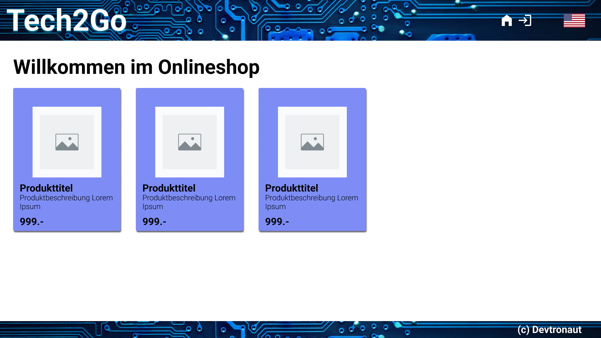
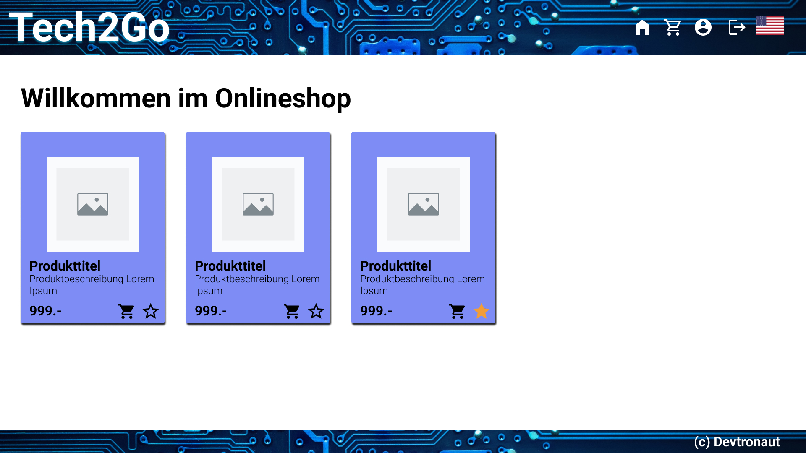
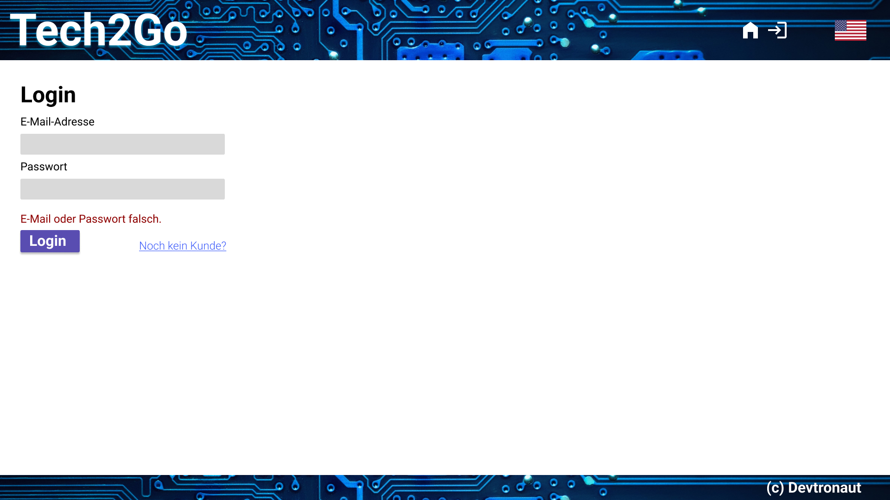
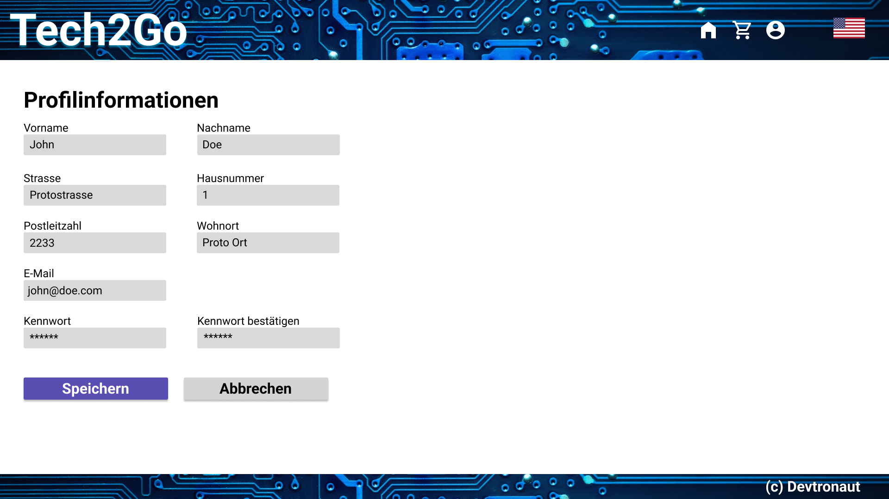
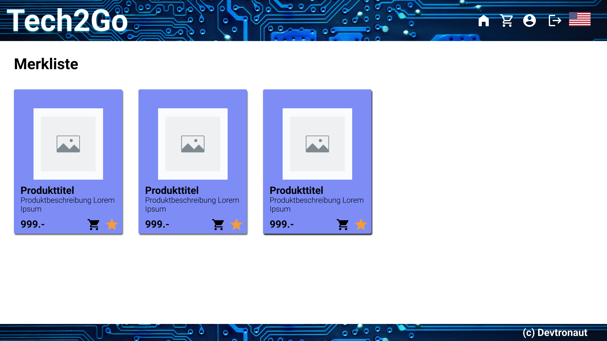
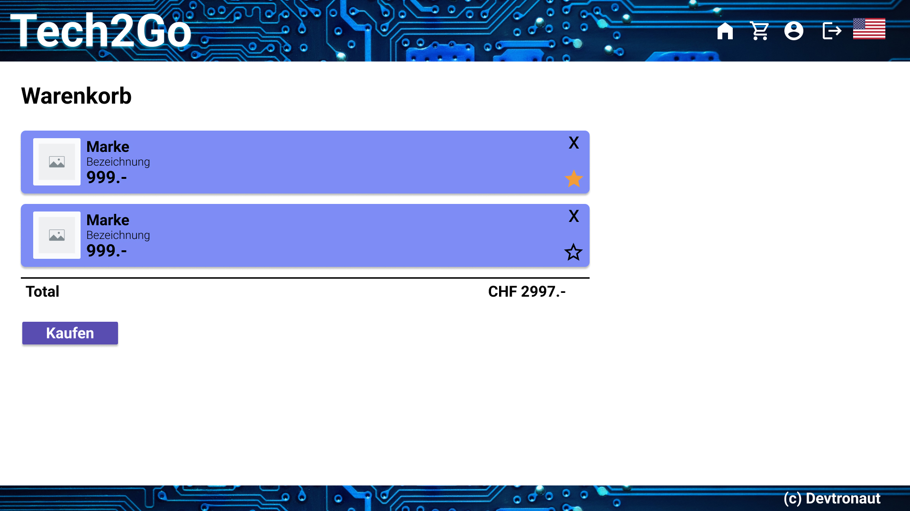
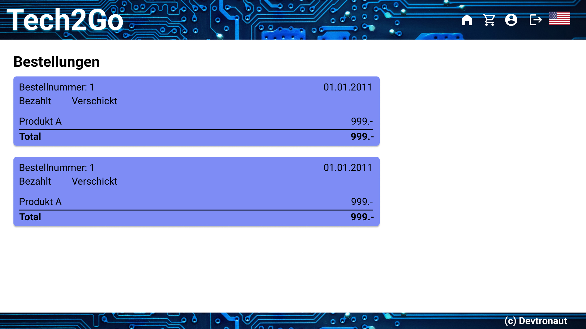
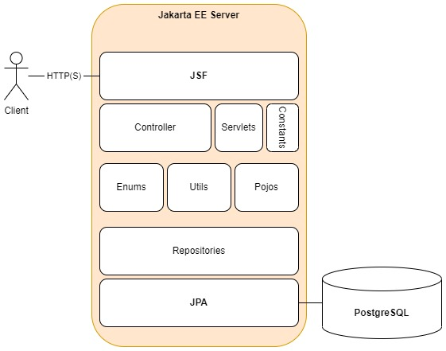

# Dokumentation: JEE Onlineshop
HS 2022, Java Enterprise Edition, Fabian Diemand  
Dozent: Daniel Senften  
Repository: https://git.ffhs.ch/fabian.diemand/jee-onlineshop/  

---

## Inhalt
- [1 Einleitung](#el_einleitung)
  - [1.1 Abgrenzung](#el_abgrenzung)
  - [1.2 Glossar](#el_glossar)
- [2 Verwendete Technologien](#vt_verwendetetechnologien)
  - [2.1 IntelliJ IDEA](#vt_intellij)
  - [2.2 Java EE 9](#vt_javaee)
  - [2.3 Glassfish Server](#vt_glassfish)
  - [2.4 PostgreSQL](#vt_postgresql)
  - [2.5 GitLab](#vt_gitlab)
  - [2.6 Docker](#vt_docker)
  - [2.7 Spezifikation (Drawio, Figma)](#vt_spezifikation)
- [3 Funktionale Anforderungen](#fa_funktionaleanforderungen)
  - [3.1 Shop - Product Overview](#fa_productoverview)
  - [3.2 Shop - Product Cart](#fa_productcart)
  - [3.3 Shop - Buy Product](#fa_buyproduct)
  - [3.4 Customer Management - Registration](#fa_registration)
  - [3.5 Customer Management - Sign In](#fa_signin)
  - [3.6 Customer Profile - Customer Info](#fa_customerinfo)
  - [3.7 Customer Profile - Wishlist](#fa_wishlist)
  - [3.8 Customer Profile - Order History](#fa_orderhistory)
- [4 Datenmodell](#dm_datenmodell)
  - [4.1 Customer](#dm_customer)
  - [4.2 Product](#dm_product)
  - [4.3 Order](#dm_order)
  - [4.4 Wishlist](#dm_wishlist)
- [5 UI & Bedienungsprototyp](#ui_prototyp)
  - [5.1 Welcome Page](#ui_welcome)
  - [5.2 Login Page](#ui_login)
  - [5.3 Register Page](#ui_register)
  - [5.4 Profile Info Page](#ui_profile_info)
  - [5.5 Profile Wishlist Page](#ui_profile_wishlist)
  - [5.6 Cart Page](#ui_cart)
  - [5.7 Orders Page](#ui_profile_orders)
- [6 Architekturentscheidungen](#ae_architekturentscheidungen)
- [7 Installation](#i_installation)
  - [7.1 Container: jak-onlineshop-database](#i_dbcontainer)  
  - [7.2 Container: jak-onlineshop-webapp](#i_webappcontainer)  
  - [7.3 Run-Konfiguration](#i_runconfig)
  - [7.4 Setup-Anleitung](#i_setup)
- [Quellen](#quellen)
- [Statusberichte](#statusberichte)

---

## 1 Einleitung
Das folgende Dokument enthält die Dokumentation der Semesterarbeit im Modul JEE (Java Enterprise Edition),
des Herbstsemesters 2022/23 an der Fernfachhochschule Schweiz (nachfolgend FFHS).
Im Kern geht es dabei um die Erweiterung des Onlineshops aus der Literatur zum Unterricht (Java EE 8, Alexander Salvanos).

### 1.1 Abgrenzung
Im Rahmen der Semesterarbeit wird sich vordergründig auf die Implementation eines Kundenprofils zum Onlineshop konzentriert.
Dabei wird das Hauptaugenmerk auf die serverseitigen Funktionen gelegt. Die Klienten-Seite wird nur in einem für eine Demo nötigen Umfang
umgesetzt. 

### 1.2 Glossar
| Begriff    | Erklärung                                                                                      |
|------------|------------------------------------------------------------------------------------------------|
| Kundschaft | Personen, die einen Kauf beabsichtigen, sich dabei registrieren oder bereits registriert sind. |
| Besuchende | Personen, die einen Kauf beabsichtigen, jedoch noch nicht registriert sind.                    |
---

## 2 Verwendete Technologien
Der Onlineshop soll eine Web-Applikation sein. Zu deren Umsetzung werden folgende Technologien verwendet.

### 2.1 IntelliJ IDEA
Als Entwicklungsumgebung für die Java EE Web-Applikation dient IntelliJ IDEA von Jetbrains.

### 2.2 Java EE 9
Gemäss der verwendeten Literatur soll für die Web-Applikation Java als Programmiersprache, in der Spezifikation EE 9,
verwendet werden.

### 2.3 Oracle Glassfish Server 6.2.5
Als Applikationsserver wird der Glassfish Open-Source-Anwendungsserver von Oracle in der Version 6.2.5 verwendet.
Glassfish ist als Anwendungsserver für Java EE konzipiert und daher speziell für dieses Vorhaben geeignet.

### 2.4 PostgreSQL 15
Das objektrelationale Datenbankmanagementsystem (ORDBMS) PostgreSQL wird genutzt, um die Datenpersistenz zu gewährleisten.

### 2.5 GitLab
Für die Source-Code-Verwaltung und die Versionierung wird GitLab verwendet. Innerhalb von Gitlab werden insbesondere Issues verwendet,
um User Stories und Tasks zu erfassen. Zu Planungszwecken wird ausserdem ein Board mit den Phasen "Backlog", "Sprint Backlog", "Development",
"Verification" und "Done" erstellt.

Die Branch-Strategie folgt grundsätzlich den Empfehlungen des Git-flow-Workflow (vgl. [GitFlow]).

### 2.6 Docker  
Für das Deployment bzw. die Abgabe der Applikation wird eine Container-Gruppe mit Docker Compose zur Verfügung gestellt.

### 2.7 Spezifikation (Drawio, Figma)
Für sämtliche Modelle und Diagramme wurde [Drawio](https://www.diagrams.net/) verwendet.
Der UI- und Bedienungsprototyp wurde mit [Figma](https://www.figma.com/de) erstellt.

---

## 3 Funktionale Anforderungen
Die funktionalen Anforderungen werden in der Form von User Stories erfasst. Jede User Story enthält eine Kurzbeschreibung, 
eine längere technischere Beschreibung und eine Definition-of-Done (DoD) mit Akzeptanzkriterien. Ausserdem enthalten einige
User Stories eine Definition-of-Ready, wenn entsprechende Abhängigkeiten bestehen.

Für die Umsetzung werden alle User Stories in Tasks aufgebrochen, welche wie die User Stories selbst als Issues im entsprechenden
GitLab Repository erfasst sind. Im Rahmen der Dokumentation wird nur auf die User Stories eingegangen. Der Übersicht halber werden
diese in Use-Case-Form erfasst.

### 3.1 Shop - Product Overview
<table>
  <tr>
    <th>Name</th>
    <td>Shop - Product Overview</td>
  </tr>
  <tr>
    <th>Ziel</th>
    <td>
      Akteure erhalten einen Überblick über die zur Verfügung stehenden Produkte mit den Optionen diese in einem Warenkorb oder einer Favoritenliste abzulegen.
    </td>
  </tr>
  <tr>
    <th>Akteure</th>
    <td>Kundschaft</td>
  </tr>
  <tr>
    <th>Vorbedingung</th>
    <td>-</td>
  </tr>
  <tr>
    <th>Auslösendes Ereignis</th>
    <td>Akteure besuchen den Onlineshop.</td>
  </tr>
  <tr>
    <th>Nachbedingung Normalfall</th>
    <td>Akteure sehen alle zur Verfügung stehenden Produkte.</td>
  </tr>
  <tr>
    <th>Normalfall</th>
    <td>
      1. Akteure besuchen den Onlineshop 
      2. Akteure werden direkt auf die Produktübersicht geroutet 
    </td>
  </tr>
</table>

### 3.2 Shop - Product Cart
<table>
  <tr>
    <th>Name</th>
    <td>Shop - Product Cart</td>
  </tr>
  <tr>
    <th>Ziel</th>
    <td>Akteure können Produkte in einen Warenkorb legen, die sie später kaufen möchten.</td>
  </tr>
  <tr>
    <th>Akteure</th>
    <td>Kundschaft</td>
  </tr>
  <tr>
    <th>Vorbedingung</th>
    <td>Im Shop stehen Produkte zum Kauf zur Verfügung.</td>
  </tr>
  <tr>
    <th>Auslösendes Ereignis</th>
    <td>Akteur will Produkt kaufen.</td>
  </tr>
  <tr>
    <th>Nachbedingung Normalfall</th>
    <td>Produkte die gekauft werden sollen liegen im Warenkorb.</td>
  </tr>
  <tr>
    <th>Nachbedingung Sonderfall</th>
    <td>
      1a. Produkte, die im Warenkorb liegen, werden mit ausgegrautem Knopf für die Ablage dargestellt.
      2a. Kaufknopf steht erst ab mindestens einem Produkt im Warenkorb zur Verfügung.
    </td>
  </tr>
  <tr>
    <th>Normalfall</th>
    <td>
      1. Akteur klickt auf den Knopf, der ein Produkt in den Warenkorb legt 
      2. Akteur klickt im Warenkorb auf den Knopf, um die abgelegten Produkte zu kaufen 
    </td>
  </tr>
  <tr>
    <th>Sonderfall</th>
    <td>
      1a. Akteur will Produkt in den Warenkorb legen, das bereits in diesem liegt. 
      2a. Akteur will den Kaufknopf eines leeren Warenkorbs klicken  
    </td>
  </tr>
</table>

### 3.3 Shop - Buy Product
<table>
  <tr>
    <th>Name</th>
    <td>Shop - Buy Product</td>
  </tr>
  <tr>
    <th>Ziel</th>
    <td>Registrierte Kundschaft kann Produkte kaufen, welche zuvor im Warenkorb abgelegt wurden.</td>
  </tr>
  <tr>
    <th>Akteure</th>
    <td>Kundschaft</td>
  </tr>
  <tr>
    <th>Vorbedingung</th>
    <td>Zu kaufende Produkte wurden im Warenkorb abgelegt.</td>
  </tr>
  <tr>
    <th>Auslösendes Ereignis</th>
    <td>Kundschaft klickt im Warenkorb auf die Schaltfläche, um die abgelegten Produkte zu kaufen.</td>
  </tr>
  <tr>
    <th>Nachbedingung Normalfall</th>
    <td>Waren wurden bestellt.</td>
  </tr>
  <tr>
    <th>Normalfall</th>
    <td>
      1. Akteur klickt auf die Schaltfläche zum Kauf  
      2. Produkte sind im Profil unter Bestellungen zu finden  
    </td>
  </tr>
</table>

### 3.4 Customer Management - Registration
<table>
  <tr>
    <th>Name</th>
    <td>Customer Management - Registration</td>
  </tr>
  <tr>
    <th>Ziel</th>
    <td>
      Besuchende des Onlineshops sollen sich registrieren können, um persönliche Informationen abzulegen, 
      Produkte kaufen und in einer Wunschliste erfassen zu können.
    </td>
  </tr>
  <tr>
    <th>Akteure</th>
    <td>Besuchende</td>
  </tr>
  <tr>
    <th>Vorbedingung</th>
    <td>-</td>
  </tr>
  <tr>
    <th>Auslösendes Ereignis</th>
    <td>Besuchende klicken den "Registrieren"-Knopf im Onlineshop.</td>
  </tr>
  <tr>
    <th>Nachbedingung Normalfall</th>
    <td>
      Akteure sind als registrierte Kundschaft mit eigenem Profil, Authentifikationsdaten und persönlichen Informationen erfasst.
    </td>
  </tr>
  <tr>
    <th>Nachbedingung Sonderfall</th>
    <td>
      2a. Formular kann nicht abgeschlossen werden, solange noch Informationen fehlen  
      3a. Akteur wird darauf aufmerksam gemacht, dass die E-Mail Adresse bereits vergeben ist  
    </td>
  </tr>
  <tr>
    <th>Normalfall</th>
    <td>
      1. Akteure klicken auf das Login-Icon in der Nav-Bar & anschliessend auf den "Registrieren"-Link  
      2. Akteure tippen ihre persönlichen Informationen Formularfeldern ein  
      3. Akteure legen eine E-Mail Adresse fest  
      3. Akteure legen ein Passwort fest und bestätigen dieses  
      4. Akteure klicken den "Registrieren"-Knopf  
    </td>
  </tr>
  <tr>
    <th>Sonderfall</th>
    <td>
      2a. Persönliche Informationen werden von der Kundschaft nicht ergänzt.  
      3a. E-Mail-Adresse ist bereits im Kundensystem erfasst.  
    </td>
  </tr>
</table>

### 3.5 Customer Management - Sign In
<table>
  <tr>
    <th>Name</th>
    <td>Customer Management - Sign In</td>
  </tr>
  <tr>
    <th>Ziel</th>
    <td>
      Registrierte Kundschaft kann sich in deren Profil einloggen, um Daten zu modifizieren, Wunschliste und Bestellstatus zu
      überprüfen.    
    </td>
  </tr>
  <tr>
    <th>Akteure</th>
    <td>Registrierte Kundschaft</td>
  </tr>
  <tr>
    <th>Vorbedingung</th>
    <td>Akteure sind bereits registrierte Kundschaft.</td>
  </tr>
  <tr>
    <th>Auslösendes Ereignis</th>
    <td>Registrierte Kundschaft klickt den "Login"-Knopf im Onlineshop.</td>
  </tr>
  <tr>
    <th>Nachbedingung Normalfall</th>
    <td>Registrierte Kundschaft ist eingeloggt und hat Zugang zu ihrem Profil, sowie einer Übersicht der Bestellungen und einer Wunschliste.</td>
  </tr>
  <tr>
    <th>Nachbedingung Sonderfall</th>
    <td>
      1a./2a. Akteure bekommen eine diskrete Fehlermeldung angezeigt.
    </td>
  </tr>
  <tr>
    <th>Normalfall</th>
    <td>
      1. Akteur wird zur Eingabe der E-Mail aufgefordert  
      2. Akteur wird zur Eingabe des Passworts aufgefordert  
      4. Akteur bestätigt das Login  
    </td>
  </tr>
  <tr>
    <th>Sonderfall</th>
    <td> 
      1a./2a. E-Mail oder Passwort stimmen nicht überein   
    </td>
  </tr>
</table>

### 3.6 Customer Profile - Customer Info
<table>
  <tr>
    <th>Name</th>
    <td>Customer Profile - Customer Info</td>
  </tr>
  <tr>
    <th>Ziel</th>
    <td>Akteure sollen ihre Informationen einsehen und bearbeiten können, um ihr Profil auf dem neusten Stand zu halten.</td>
  </tr>
  <tr>
    <th>Akteure</th>
    <td>Registrierte Kundschaft</td>
  </tr>
  <tr>
    <th>Vorbedingung</th>
    <td>Akteure verfügen bereits über ein Profil mit persönlichen Informationen und sind angemeldet .</td>
  </tr>
  <tr>
    <th>Auslösendes Ereignis</th>
    <td>Akteure klicken das Profil-Icon auf einer beliebigen Ansicht des Onlineshops.</td>
  </tr>
  <tr>
    <th>Nachbedingung Normalfall</th>
    <td>
      Persönliche Informationen der Akteure sind aktualisiert.
    </td>
  </tr>
  <tr>
    <th>Nachbedingung Sonderfall</th>
    <td>
      4a. Prozess kann nur abgeschlossen werden, wenn alle Informationen valide sind. Akteure werden auf invalide Eingaben hingewiesen.
    </td>
  </tr>
  <tr>
    <th>Normalfall</th>
    <td>
      1. Akteure sehen auf einer Übersicht alle persönlichen Informationen im Profil  
      2. Akteure klicken "Information bearbeiten"  
      3. Akteure sehen eine Formular-Ansicht, die die Bearbeitung der Daten erlaubt  
      4. Akteure klicken "Profil aktualisieren", um die Änderungen zu persistieren  
    </td>
  </tr>
  <tr>
    <th>Sonderfall</th>
    <td>
      4a. Eingaben der Akteure entsprechen nicht den festgelegten Validitätskriterien  
    </td>
  </tr>
</table>

### 3.7 Customer Profile - Wishlist
<table>
  <tr>
    <th>Name</th>
    <td>Customer Profile - Wishlist</td>
  </tr>
  <tr>
    <th>Ziel</th>
    <td>Akteure können Produkte in einer Merkliste ablegen, um schneller auf favorisierte Produkte zugreifen zu können.</td>
  </tr>
  <tr>
    <th>Akteure</th>
    <td>Registrierte Kundschaft</td>
  </tr>
  <tr>
    <th>Vorbedingung</th>
    <td>Akteure sind angemeldet.</td>
  </tr>
  <tr>
    <th>Auslösendes Ereignis</th>
    <td>Akteure klicken auf das "Merkliste"-Icon eines Produkts.</td>
  </tr>
  <tr>
    <th>Nachbedingung Normalfall</th>
    <td>
      Akteur sieht eine Übersicht aller favorisierten Produkte.
    </td>
  </tr>
  <tr>
    <th>Nachbedingung Sonderfall</th>
    <td>-</td>
  </tr>
  <tr>
    <th>Normalfall</th>
    <td>
      1. Produkt wird als Favorit gekennzeichnet
      2. Akteur klickt auf das "Merkliste"-Icon im Profil
    </td>
  </tr>
  <tr>
    <th>Sonderfall</th>
    <td>-</td>
  </tr>
</table>

### 3.8 Customer Profile - Order History
<table>
  <tr>
    <th>Name</th>
    <td>Customer Profile - Order History</td>
  </tr>
  <tr>
    <th>Ziel</th>
    <td>Akteure erhalten eine Übersicht über getätigte Bestellungen und deren Status.</td>
  </tr>
  <tr>
    <th>Akteure</th>
    <td>Registrierte Kundschaft</td>
  </tr>
  <tr>
    <th>Vorbedingung</th>
    <td>Akteure sind angemeldet. Bestellungen sind vorhanden.</td>
  </tr>
  <tr>
    <th>Auslösendes Ereignis</th>
    <td>Akteure klicken das "Bestellungen"-Icon auf der Profilübersicht.</td>
  </tr>
  <tr>
    <th>Nachbedingung Normalfall</th>
    <td>Akteure können ihre Bestellungen einsehen.</td>
  </tr>
  <tr>
    <th>Nachbedingung Sonderfall</th>
    <td>
      Akteure werden über einen textlichen Output über die leere Bestellhistorie informiert.
    </td>
  </tr>
  <tr>
    <th>Normalfall</th>
    <td>-</td>
  </tr>
  <tr>
    <th>Sonderfall</th>
    <td>
      Keine Bestellungen vorhanden.
    </td>
  </tr>
</table>

---

## 4 Datenmodell
Das gesamte Datenmodell enthält Kunden (mit Adressen & Wohnorten, vgl. 4.1), Produkte (vgl. 4.2),
Bestellungen (vgl. 4.3) und einer Merkliste (vgl. 4.4).

### 4.1 Customer
Die Tabelle für die Kundendaten enthält persönliche Informationen über die Kundschaft, sowie die Authentifikationsdaten (E-Mail, Passwort).
Die Einzigartigkeit jedes Kunden wird über die E-Mail-Adresse sichergestellt. Die Customer-Entitäten werden versioniert, um die Aktualität
der Daten in der Applikation sicherzustellen.

Die Daten zur Adresse der Kunden sind in eine eigene Tabelle ausgelagert, um den Ansprüchen der Normalisierung zu entsprechen.
Bei der Adresstabelle sind aus demselben Grund wiederum ausgelagert. Beide Tabellen haben ein Versionsattribut.

### 4.2 Product
Die Tabelle für Produktdaten enthält alle notwendigen Daten über ein Produkt, wie Name, Beschreibung und Preis. Daneben auch 
ein Attribut für den Fremdschlüssel des Verkäufers und den Fremdschlüssel eines potenziellen Käufers.
Speziell an der Produkttabelle ist das Image Attribut, das eine Binär-Repräsentation eines Produktbilds enthält. 
Wie alle anderen Entitäten sind auch die Produkt-Entitäten versioniert. 

### 4.3 Order
Bestellungen werden mithilfe einer Tabelle für die Informationen über eine Bestellung und einer Hilfstabelle für die Many-to-Many
Beziehung zwischen Produkten und Bestellungen abgebildet.
Die Many-to-Many Beziehung wäre in dieser Form für den aktuellen Stand des Onlineshops nicht nötig. Im Sinne der Erweiterbarkeit
hat sich der Entwickler dazu entschieden, die Relation dennoch als M-to-M und nicht als M-to-1 zu modellieren.
Auf die Bestellungs-Entitäten wird nach der Erstellung nur noch lesend zugegriffen. Daher entfällt hier die Versionierung.  

### 4.4 Wishlist
Die Wishlist-Tabelle ist eine einfache Hilfstabelle für die Many-to-Many Beziehung zwischen Kunden und Produkten in Form einer Merkliste.
Zu der Merkliste sind auch keine weiteren Informationen notwendig, weshalb eine eigene Tabelle (vgl. 4.3 Orders) entfällt. 

---

## 5 UI & Bedienungsprototyp
Die UI und Bedienungsprototypen wurden im Vorgang zum eigentlichen Entwicklungsprozess erstellt, um bei der Umsetzung
nicht mehr viel Zeit in die Konzeption der Oberflächen stecken zu müssen, sondern direkt mit deren Umsetzung als Code beginnen zu können.
Wie eingangs erwähnt, wurde für die Umsetzung der Prototypen [Figma](https://www.figma.com/de) verwendet. 

Letztlich kam es bei der Umsetzung zu kleineren Abweichungen, teils weil die Technologie (JSF) gewisse Dinge nicht im Rahmen
der sinnvollen Zeit erlaubte, teils weil der Entwickler sich zu praktischeren Ansätzen entschied, als im Entwurf vorgesehen.

### 5.1 Welcome Page
Besucher des Onlineshops werden direkt mit einer Übersicht über alle verfügbaren Produkte begrüsst. Im nicht-eingeloggten Zustand, ist auf 
dieser Seite kaum etwas möglich. Lediglich die Navigationsoptionen für die Homepage, fürs Login bzw. die Registrierung und den Wechsel der Sprache
stehen zur Verfügung.  
    
Einmal eingeloggt, werden zusätzlich die Navigationsoptionen für den Einkaufswagen und das Kundenprofil verfügbar. Die Option fürs Login wird
nun durch die Möglichkeit fürs Logout ersetzt. Die Produktkarten bieten im eingeloggten Zustand die Funktionalität, zum Warenkorb hinzugefügt,
oder in einer Wunschliste abgelegt zu werden.  

### 5.2 Login Page
Klickt der Besucher auf der Welcome Page den Login-Knopf, kann er sich entweder einloggen, oder sich auf die Registrationsseite (vgl. 5.3)
weiterleiten lassen. Im Login-Formular müssen die E-Mail-Adresse und das Passwort eingetragen werden. Können diese nicht verifiziert werden,
wird der Besucher mit einer Fehlernachricht darauf hingewiesen. 

### 5.3 Register Page
Will sich der Besucher des Onlineshops nicht einloggen, sondern zuerst registrieren, lässt er sich auf die Regirationsseite weiterleiten. 
Hier wird er dazu aufgefordert, seine persönlichen Informationen in einem Formular einzutragen.
Das Passwort muss bestätigt werden. Passwort und E-Mail-Adresse dienen letztlich der Authentifizierung.  

### 5.4 Profile Info Page
Ist ein Kunde im Onlineshop eingeloggt, hat er die Möglichkeit, seine persönlichen Daten zu verändern. Das Formular sieht jenem der
Registrationsseite sehr ähnlich, beinhaltet allerdings bereits die jeweiligen Daten des Kunden. Dadurch dient es der Übersicht und 
Anpassung gleichermassen.  

### 5.5 Profile Wishlist Page
Produkte, die auf der Hauptseite in die Merkliste verschoben wurden, werden in der Merkliste angezeigt. Die Merkliste
ist über ein Drop-Down-Menü von der Profil-Option in der Navigation aus erreichbar. Produkte sehen identisch aus, wie 
jene der Welcome Page (vgl. 5.1), können von hier aus ebenfalls in den Warenkorb verschoben, oder direkt wieder aus der
Merkliste entfernt werden. Produkte auf der Merkliste, die zwischenzeitlich verkauft wurden, werden entsprechend markiert.  

### 5.6 Cart Page
Produkte, die auf der Hauptseite in den Warenkorb verschoben wurden, werden hier angezeigt. Die Merkliste ist über ein Drop-Down-Menü
von der Profil-Option in der Navigation aus erreichbar. Die Darstellung der Produkte weicht von der bisherigen Card-Darstellung ab.
Dies damit die Preise horizontal untereinander stehen und somit visuell besser mit der Darstellung des Totals vereinbar sind. Produkte 
können über das Kreuz oben rechts wieder aus dem Warenkorb entfernt werden. Wird der Kaufen-Knopf geklickt, ist die Liste danach in der
Bestellübersicht (vgl. 5.7) ersichtlich. 

### 5.7 Orders Page
Wurde die Bestellung einer Liste von Produkten im Warenkorb ausgelöst, ist diese danach in der Bestellübersicht auffindbar. 
Eine Bestellung enthält hier die Übersicht über Bezahlungsstatus, Versandstatus, Produktliste und Totalpreis der Bestellung.  

---

## 6 Architekturentscheidungen
Die Dokumentation der Architekturentscheidungen bezieht sich nur auf den gewählten Fokusbereich des Kundenprofils, sowie auf 
die Funktionalitäten der Registration und des Logins.

Die nachfolgende Darstellung zeigt den Aufbau der Applikation. Dieser Aufbau folgt einem MVC-Pattern. 

Für die Umsetzung des Data-Layer (Model) wird die Jakarta Persistence API (JPA) verwendet. Der Datenbankzugriff wird dabei zusätzlich durch ein Repository-Pattern abstrahiert.
Im Business-Layer (Controller; nicht verwechseln mit der Controller-Komponente des Präsentations-Layers!) kommen Utility-Klassen zum Einsatz, Enums und ein Pojo für die Warenkorb-Funktionalität.
Der Präsentations-Layer (View) setzt auf Jakarta Server Faces (JSF) und JSF-Facelets für die Oberflächengestaltung bzw. -generierung. Mit Controllern wird die Business-Logik abstrahiert.
Servlets werden für asynchrone Operationen (Bilder laden) eingesetzt.

### 6.1 Sequenzdiagramme

---

## 7 Installation
Für eine unkomplizierte Installation, ohne den Server selbst konfigurieren zu müssen, wird auf Docker gesetzt.
Das [docker-compose.yml](../docker/docker-compose.yml) im Verzeichnis 'jakarta-onlineshop/docker' setzt eine 
Container Group _**'jak-onlineshop-congrp'**_ bestehend aus zwei Containern _**'jak-onlineshop-database'**_ und _**'jak-onlineshop-webapp'**_ auf.
Die beiden Container kommunizieren über ein bridge-Netzwerk namens _**'jak-onlineshop-network'**_.
Der ganze Prozess wird in einer Run-Konfiguration zusammengehalten.

### 7.1 Container: jak-onlineshop-database
Der Container basiert auf dem aktuellsten PostgreSQL Image. Darin werden ein User (onlineshop_user), mit Passwort (shop_12345) und eine Datenbank (jak_onlineshop)
aufgesetzt. Mit diesen Credentials kann z.B. über das Database Widget in IntelliJ über _host.docker.internal:5432/jak_onlineshop_ eine Verbindung zu der Datenbank
hergestellt werden.
Die Datenbank wird mit einem Script beim Start des Containers entsprechend der Bedürfnisse der Applikation aufgesetzt.

### 7.2 Container: jak-onlineshop-webapp
Das Base-Image für den Container ist ein um eine Glassfish Installation und den PostgreSQL JDBC Driver erweitertes jdk11 Image, das vom 
Autor veröffentlicht wurde und somit von Dockerhub bezogen werden kann. Dadurch entfällt die Konfiguration des Servers gänzlich.
Das war-File der Applikation wird über einen Mount direkt ins autodeploy Verzeichnis des Glassfish Servers im Container kopiert.

### 7.3 Run-Konfiguration
Die Run-Konfiguration builded zunächst das Projekt, sodass unter 'build/lib/tech2go.war' die aktuellste Version zur Verfügung steht.
Danach werden die beiden Container mit den bereits erwähnten Konfigurationen aufgesetzt und gestartet.

### 7.4 Setup-Anleitung
Die Anleitung geht davon aus, dass der Anwender den aktuellsten Release im Main-Branch des [Repositories](https://git.ffhs.ch/fabian.diemand/jakarta-onlineshop/-/tree/main) gecloned 
und Docker bzw. Docker Desktop installiert hat.

0. Ports 5432, 8080, 8181, 4848 müssen frei sein; das Script 'jakarta-onlineshop/docker/db/01-init.sh' muss mit Unix-Style Line-Endings (LF) aufweisen
1. Starte Docker Desktop
2. In IntelliJ: Öffne die Run-Konfiguration 'Jakarta Onlineshop.run.xml' im 'jakarta-onlineshop/.run'-Verzeichnis
3. In IntelliJ: Klicke rechts im blauen Banner 'Open/ Debug Configurations...'
4. In IntelliJ: In der folgenden Übersicht der Run-Konfiguration muss evtl. 'Docker' als Server noch spezifiziert werden
5. In IntelliJ: Lasse die Konfiguration mit einem Klick auf das grüne Dreieck neben der Run-Konfiguration laufen
6. Im Browser: Besuche die URL [localhost:8080/tech2go](http://localhost:8080/tech2go/)

---

## Quellen
- [Salvanos]: _Salvanos, Alexander (2018): Professionell entwickeln mit Java EE 8: Das umfassende Handbuch. Aktuell zu Jakarta EE, 2. Aufl., Rheinwerk Computing._
- [GitFlow]: _Atlassian (o. D.): Git-flow-Workflow | Atlassian Git Tutorial, Atlassian, [online] https://www.atlassian.com/de/git/tutorials/comparing-workflows/gitflow-workflow [abgerufen am 27.10.2022]._

## Statusberichte

### Statusbericht 1: 28.09.2022
| Teilbereiche                      | Status [%] | Bemerkungen                                                                                                                                                      |
|-----------------------------------|------------|------------------------------------------------------------------------------------------------------------------------------------------------------------------|
| Spezifikation                     | 80         | - Festlegung Fokusbereich "Nutzerprofil" -User Stories und Tasks in Gitlab -Entsprechendes Board in Gitlab -Verwendete Technologien in Dokumentation |
| Entwurf                           | 20         | - Datenmodellierung angefangen in Draw.io - Oberflächenprototypen angefangen in Figma                                                                        |
| Programmierung                    | 0          |                                                                                                                                                                  |
| Validierung                       | 0          |                                                                                                                                                                  |
| Präsentation, Dokumentation, Demo | 5          | - Dokument erstellt, Titel und Gliederung festgelegt - Verwendete Technologien festgelegt und begründet                                                      |

### Statusbericht 2: 26.10.2022
| Teilbereiche                      | Status [%] | Bemerkungen                                                                   |
|-----------------------------------|------------|-------------------------------------------------------------------------------|
| Spezifikation                     | 100        | - User Stories und Tasks vollständig                                          |
| Entwurf                           | 60         | - Datenmodellierung abgeschlossen - Oberflächenprototypen fortgeschritten |
| Programmierung                    | 0          |                                                                               |
| Validierung                       | 0          |                                                                               |
| Präsentation, Dokumentation, Demo | 30         | - Spezifikation und Modellierung dokumentiert                                 |

 

### Vorlage Statusbericht <#>: <Datum>
| Teilbereiche                      | Status [%] | Bemerkungen |
|-----------------------------------|------------|-------------|
| Spezifikation                     |            |             |
| Entwurf                           |            |             |
| Programmierung                    |            |             |
| Validierung                       |            |             |
| Präsentation, Dokumentation, Demo |            |             |
